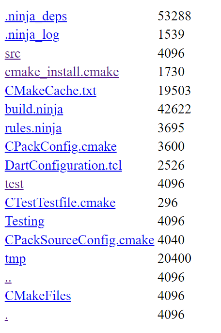

# Simple Web Server
Run this web server in your server. People can access your server in their browser by using the IP address and port number.

## Environment
  1. C++ 20 & Unix specific C
  2. Linux / WSL2 in windows
  3. CMake
  4. VSCode recoomended
   
## Roadmap
- [x] 线程池 降低响应时间
- [x] 任务队列
- [x] access files / directory of the server
- [x] not found page 404.html (copy from google's 404 page)
- [x] Epoll IO 多路复用支持高并发
- [ ] upload files to the server
- [ ] 使用线程安全的输出流

## Build & Run
Recommend to use VSCode (with Cmake extension installed) to build and run the project.

Or you can use the following commands to build the project.
```bash
cd /path/to/this/project
mkdir build && cd build
cmake .. -G Ninja
ninja -v
```
Then run the server
```bash
./src/webserver port ./
```
Here we use Ninja to build, you can use others. The `port` number is the port number you want to use, and the second argument is the root directory of the server.

## Usage
Open your browser and type `http://your_ip:port` to access the server. You can also access the files and directories in the server by typing the path in the browser.

